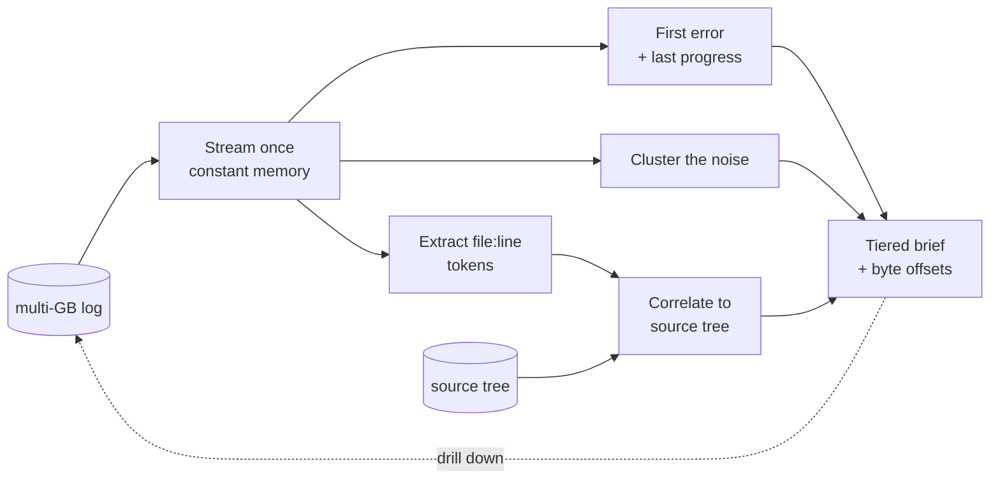

# LogLens

> **Code-aware evidence: read what the code emitted, not just the line.**

[](https://github.com/qa-veritas)
[](https://github.com/qa-veritas)
[](https://github.com/qa-veritas/loglens/actions/workflows/ci.yml)

*A component of [**QA Veritas**](https://github.com/qa-veritas) — an exploration of how AI agents reason about, verify, and operate complex systems.*

---

## Problem

A multi-gigabyte run log is too big to read and too important to skip. The reflex — `grep -i error | tail` — fails twice. It surfaces the **loudest** error (the one repeated 400 times downstream) instead of the **first** one. And it tells you a line came from `writer.py:88` without telling you what `writer.py:88` *does* — so you're triaging a string, blind to the code that produced it. Feeding the whole log to a model is worse: it's expensive, it blows the context window, and it still doesn't know what the emitting code meant.

## Core Idea

Logs are emitted by code, so evidence should point back at code. LogLens streams the log **once** in constant memory, finds the first error and the last progress checkpoint, clusters the repeated noise, and — the part that matters — resolves every `file:line` token against your source tree, so you read the *code that emitted the line*. The output is a small tiered brief (a few KB) with byte offsets back into the raw log, so you open the giant file only at the exact spot you need.

## Architecture Diagram



## Concepts

- **First error over loudest** — the cause is usually quiet and early; the cascade is loud and late.
- **Code correlation** — a `path:line` token is matched by path suffix (so `writer.py:88` resolves whether the tree has `writer.py` or `app/io/writer.py`), then the emitting line plus context is extracted. Ambiguous matches are reported, never guessed.
- **Tiered evidence** — a brief small enough to reason over, with byte ranges that make the raw log *randomly addressable* instead of a wall to scroll.
- **Constant memory** — the file is streamed, never loaded; the technique survives logs that don't fit in RAM.

## Examples

The headline output — the moment a line becomes evidence:

```
emitting code:
  writer.py:88  ->  examples/src/writer.py:88
      87  if resp.status == 403:
   >  88      raise WriteRejected("index is read-only (flood-stage guard)")
      89  # this is a capacity guard, not a permissions error
```

That block is the difference between *"an error happened at line 88"* and *"line 88 is a capacity guard, so this is an INFRA condition, not a permissions bug."*

## Quick Start

```bash
pip install -e .          # or: python -m loglens --help

python -m loglens brief --log examples/run.log --source examples/src   # the headline
python -m loglens correlate --token writer.py:88 --source examples/src # one token → code
python -m loglens scan --log examples/run.log                          # raw scan summary
```

Python 3.10+, zero third-party runtime dependencies.

## Why It Matters

For **engineers**: the slowest part of triage — "what does this line even mean?" — collapses when the brief already shows the emitting code. You read kilobytes, not gigabytes.

For **AI agents**: this is how you give a model log evidence it can actually reason about. Instead of pasting a gigabyte and paying for tokens it can't use, you hand it a code-grounded brief: the first error, the cluster shape, and the source that emitted it. It pairs directly with [State Triage](https://github.com/qa-veritas/state-triage) as the evidence stage of a reasoning pipeline.

## Future Vision

- An HTTP range-request backend so the same brief works against a remote multi-GB log without downloading it.
- A time-window filter to bound a scan to one phase.
- Pluggable signature normalizers per log format.
- Cross-reference the emitting commit (blame) so a brief points at the change that introduced the line.

---

## Part of QA Veritas

**QA Veritas** explores *AI-Native Verification Engineering* — practical patterns for a future where humans and AI agents operate complex systems together. Every component serves one loop:

**Memory → Reasoning → Verification → Action**

```
QA Veritas
├── Resource Ledger                    Memory       operational truth as a git tree
├── State Triage                       Reasoning    deterministic triage around an agent
├── LogLens           ◀ you are here   Reasoning    code-aware evidence from logs
├── Intent Verify                      Verification declarative intent → observable proof
├── Runbook Forge                      Runbooks     procedures derived from verified history
├── SkillPack                          Skills       progressive-disclosure agent capability
└── Future Agents                      Agents       narrow operators that compose the above
```

| Layer | Component |
|-------|-----------|
| Memory | [Resource Ledger](https://github.com/qa-veritas/resource-ledger) |
| **Reasoning** | [State Triage](https://github.com/qa-veritas/state-triage) · **LogLens** (this repo) |
| Verification | [Intent Verify](https://github.com/qa-veritas/intent-verify) |
| Runbooks | [Runbook Forge](https://github.com/qa-veritas/runbook-forge) |
| Skills | [SkillPack](https://github.com/qa-veritas/skillpack) |
| Writing | [Field notes & essays](https://github.com/qa-veritas/writing) |

Start at the [platform overview](https://github.com/qa-veritas). MIT licensed.
